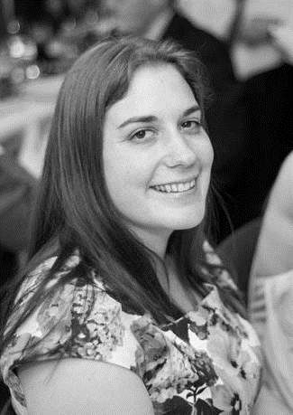

```{r setup, include=FALSE}
knitr::opts_chunk$set(echo = FALSE)
```

## presentation 

For our opening presentation, Dr Hannah Fraser spoke on May 20th at 9am Norway/5pm Melbourne.

> Replication studies: How many are happening, why they’re important and how do they apply in ecology?

Thank you to all of you that attended. For those who missed it, watch it here:

<iframe width="560" height="315" src="https://www.youtube.com/embed/3hnYSTXkoJA" frameborder="0" allow="accelerometer; autoplay; encrypted-media; gyroscope; picture-in-picture" allowfullscreen></iframe>

## bio

{width=30%}

Hannah Fraser is President of the Association of Interdisciplinary Meta-Research and Open Science. She is an ecology meta-researcher working at the University of Melbourne as part of the interdisciplinary meta-research group with a passion for learning how to make ecology research more reliable. 

## abstract

Large-scale replication studies projects in medicine and the social sciences have shown that studies often yield different results when they are repeated. This problem is driven problematic aspects of the academic culture: a bias towards publishing results that are novel and ‘find something’ and the pressure to publish frequently drive researchers to engage in questionable research practices. These practices increase the amount of results in the literature which don’t represent real world effects or relationships. Conducting replication studies allows us to investigate which portions of the literature could form a reliable basis for decisions and which portions need further study. Hannah will discuss some of her findings about researchers usage of questionable research practices and views of replication studies as well as some of her ongoing and prospective work on replication in ecology.
